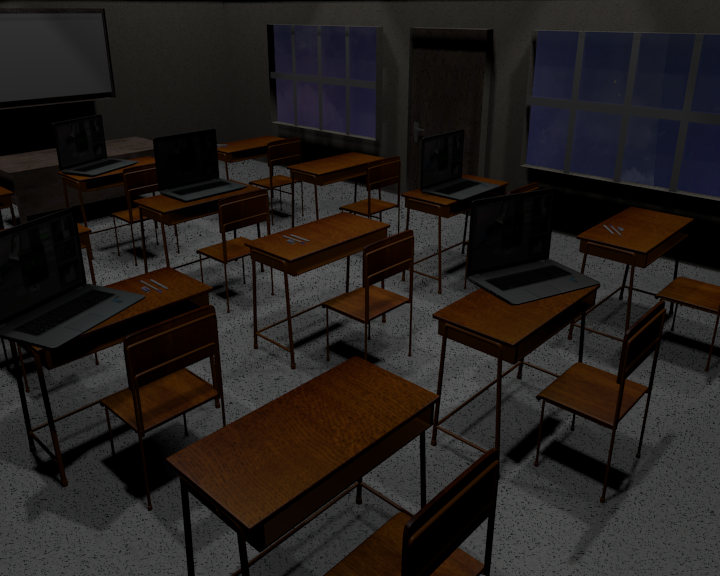
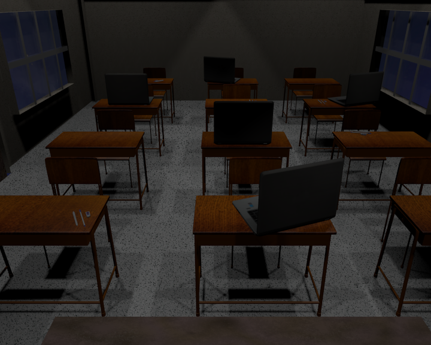
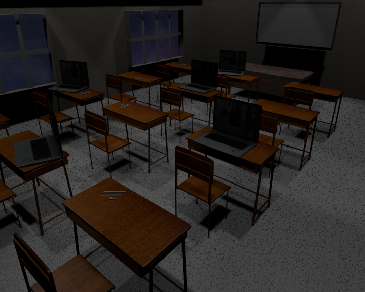

# ComputerGraphics-TrilogyGraphs
Computer Graphics Course Project 1: Blender Project

| | |
| --- | --- |
| Description | Do a Blender project showing an inside scene. Try to make it thematic, such as Japanese room, my living room, space shuttle room, futuristic room, etc. Grade will be based on modelling, textures, lighting and scene composition (camera and object placement). Follow the 10 principles of photo realism. See attachment for project description, rubric and photo realism principles. Prepare a brief presentation shown your rendering and a few points about your scene. Upload your presentation in the designated discussion forum. |
| Deliverable | A ZIP file containing: A jpg image showing your rendered model. Blender project file. Original code of fractal program generation. A PPT file with an executive summary touching all point of the rubric. Upload also a jpg preview of your project |
| Date and Time | Web Sep 13 |
| Delivery Mode | This homework is team based activity. Do the project lab in Blender. Make a jpg file containing the results of your project. Upload your Blender project file, the ppt presentation, the fractal generating code and the jpg rendering to platform using the appropriate link n this web page. Assistance to team presentation is mandatory. All participants must show equal mastery of presented subject and must speak approximately equal time with equal difficulty in spoken topics |

## Final product
Final Files where too large for uploading to github, feel free to contact me for more info.

