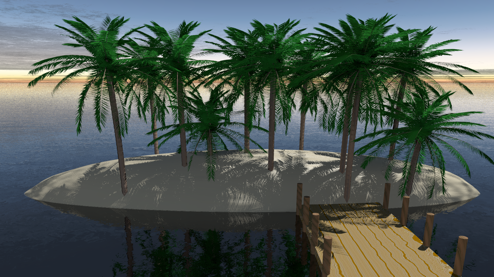

# Project 2: POV Ray Project
Computer Graphics Course Project 2: POV Ray Project

| | |
| --- | --- |
| Description | Show an fantastic outside scene. Make an alien or make believe river valley, or a town, or alien/fantastic landscape. Try to make it thematic, such nature, beauty, urban clutter, pollution, freedom, audacity, redemption/atonement, hope, courage, etc. Grade will be based on modelling, textures, lighting and scene composition (camera and object placement). Follow the 10 principles of photo realism. Add Mountains, trees, rocks, houses/buildings, lighting and cameras. The scene must contain Julia or Mandelbrot fractal (maybe a planet, maybe a forgotten picture). The terrain must be generated using Midpoint displacement.. The scene must contain Julia or Fractal (maybe a planet, maybe a forgotten picture). The terrain must be generated using Midpoint displacement. See attachment for project description, rubric and photo realism principles. Prepare a brief presentation shown your rendering and a few points about your scene. Upload your presentation in the designated discussion forum. |
| Deliverable | A ZIP file containing:  jpg images showing your rendered model. POV Ray project file. Original code of fractal landscape program generation and Julia or Mandelbrot fractal. A PPT file with an executive summary touching all point of the rubric. Upload also a jpg preview of your project |
| Date and Time | Wed Nov 1 |
| Delivery Mode | This homework is team based activity. Do the project lab in POV Ray. Make a jpg file containing the results of your project. Upload your POV Ray project file, the ppt presentation, the fractal landscape generating code and the jpg rendering to platform using the appropriate link in this web page. Assistance to team presentation is mandatory. All participants must show equal mastery of presented subject and must speak approximately equal time with equal difficulty in spoken topics |

## Final Product
