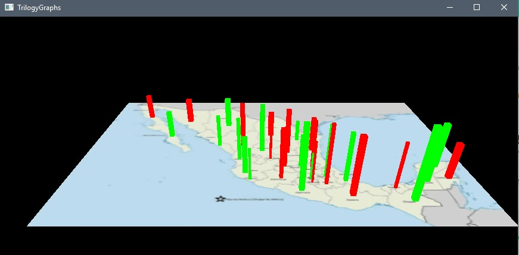
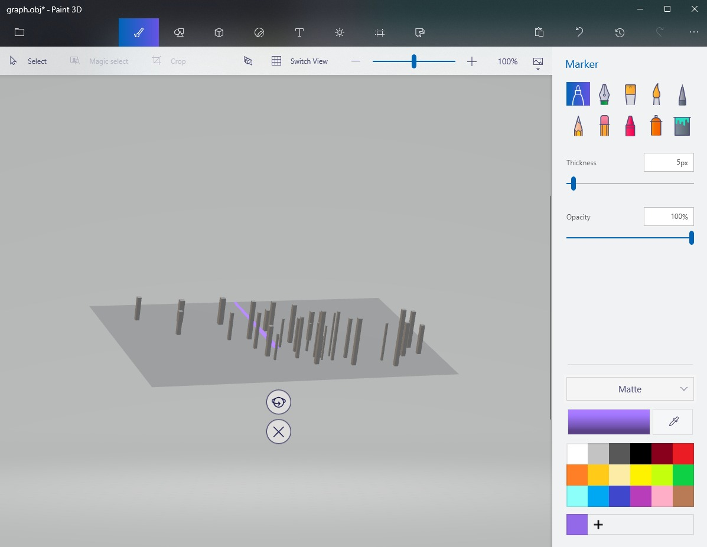
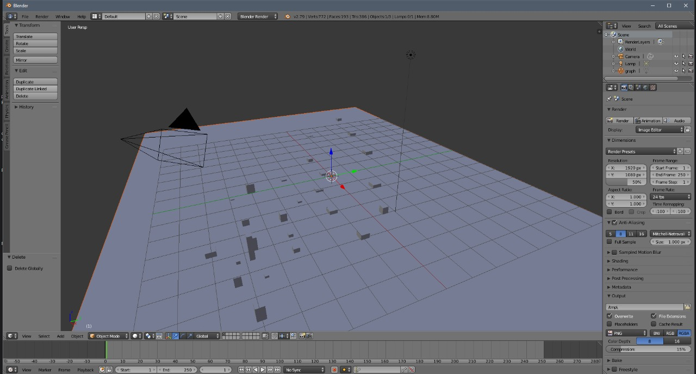

# ComputerGraphics-TrilogyGraphs
Computer Graphics Course Final Proyect

| | |
| --- | --- |
| Description | Review your OpenGL assigned project and develop the necessary OpenGL code. Generate jpg images and a PPT presentation |
| Deliverable | A ZIP file containing: A jpg images showing your rendered model. Original OpenGL code. A PPT file with an executive summary touching all point of the rubric. Any other necessary file or link. Upload also a jpg preview of your project |
| Date and Time | Wed Nov 29, 9:00am |
| Delivery Mode | This homework is team based activity. Do the OpenGL projects. Make a jpg file containing the results of your project. Upload your OpenGL project file, the ppt presentation and the jpg rendering to platform using the appropriate link in this web page. Assistance to team presentation is mandatory. All participants must show equal mastery of presented subject and must speak approximately equal time with equal difficulty in spoken topics |

## Final Product
>   Before compiling a cpp file update paths!!!

A `.exe` file named `"FinalProject.exe"` was made for convenience.

